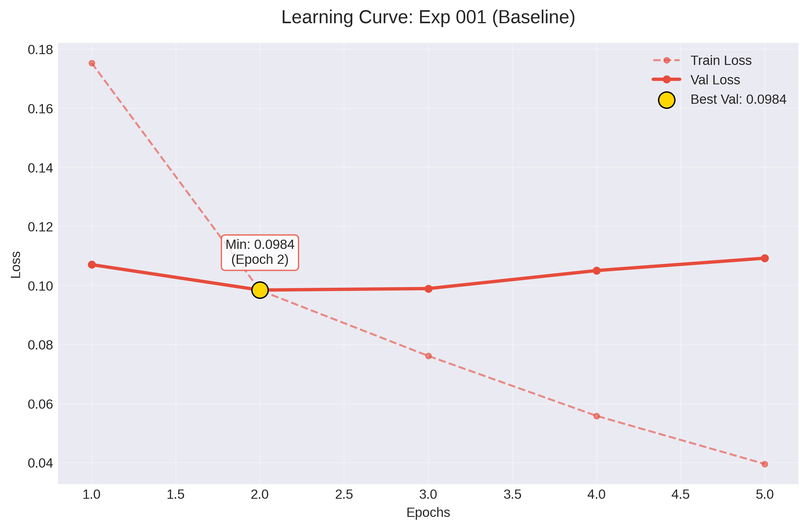
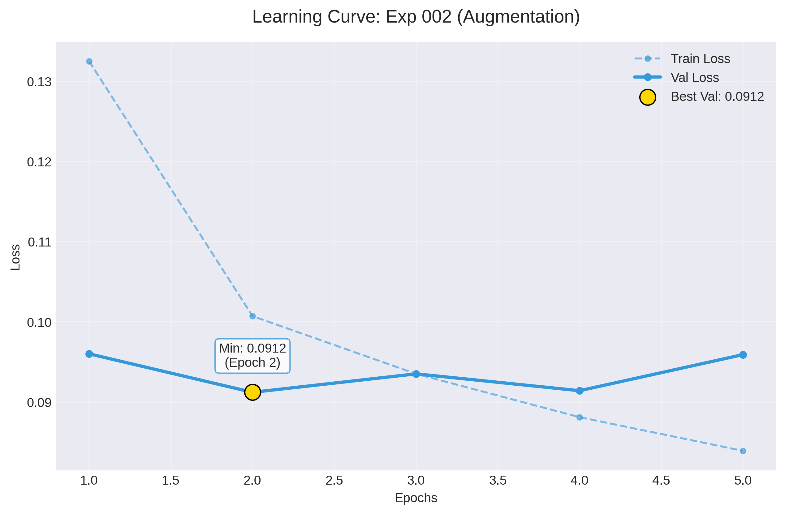
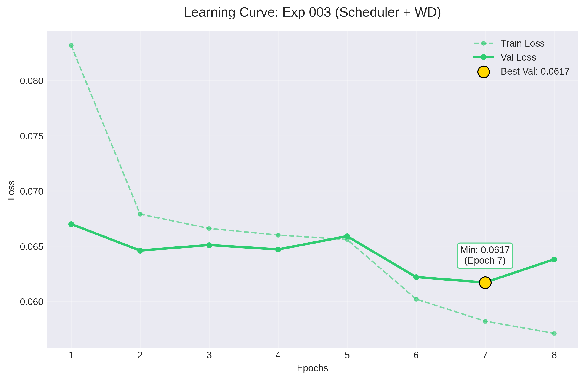
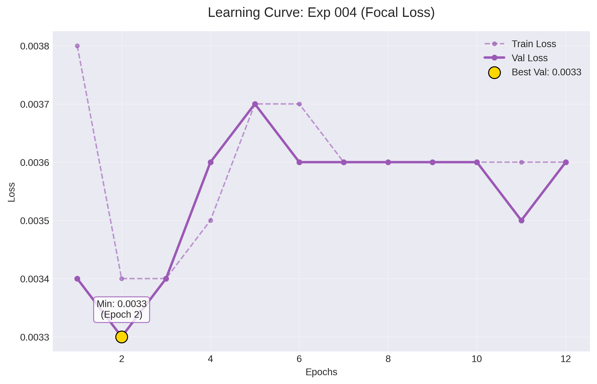
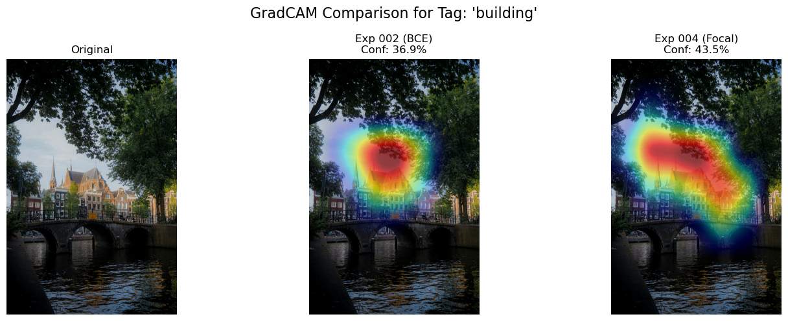
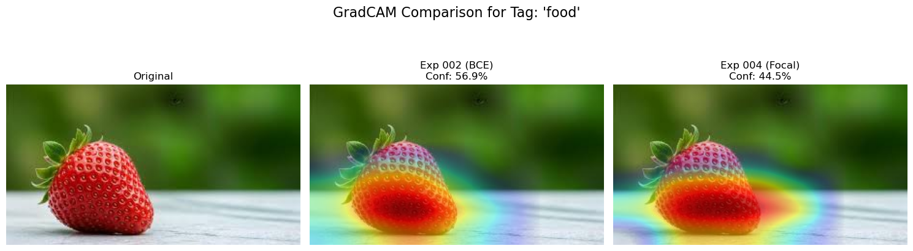
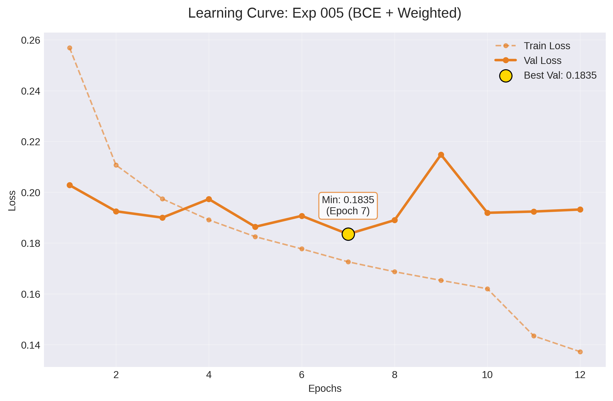
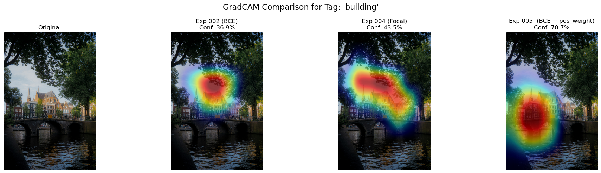
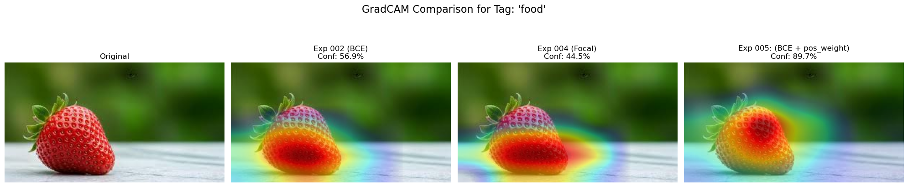

# Experiment Log

## Experiment 001: Baseline
**Дата:** 24.12.2025
**Статус:** Overfitting

### Configuration
* **Dataset:** Kaggle Various Tagged Images
* **Samples:** 10,000 (80/20)
* **Classes:** Top-30 (Raw tags, no synonyms)
* **Model:** ResNet-18 (Pretrained)
* **Augmentation:** None (Resize + Normalize only)

### Results
| Epoch | Train Loss | Val Loss | Комментарий |
|-------|------------|----------|-------------|
| 1     | 0.1753     | 0.1070   | Нормальный старт |
| 2     | 0.0983     | **0.0984** | Лучшая точка |
| 3     | 0.0761     | 0.0989   | Val Loss начал расти |
| 4     | 0.0558     | 0.1050   | Переобучение усиливается |
| 5     | 0.0395     | 0.1092   | Сильное переобучение |

### Conclusions
1. Модель быстро выучивает тренировочную выборку (Loss падает до 0.04).
2. Валидация деградирует после 2-й эпохи.
3. **Проблема:** Шумные теги (human vs person) и отсутствие регуляризации.

---

## Experiment 002: Synonyms + Dropout + Augmentation
**Дата:** 25.12.2025
**Статус:** Success

### Changes
1. **Data:**
   - Внедрен словарь синонимов (`human` -> `person`) и иерархия (`man` -> `person`).
   - Увеличен размер выборки: **50,000** сэмплов (80/20).
2. **Model:** Добавлен слой `Dropout(p=0.4)` перед классификатором.
3. **Training:**
   - Augmentation: RandomCrop, RandomFlip, RandomRotation, ColorJitter
   - Сохранение только лучшей модели (`early_stopping`).

### Results
| Epoch | Train Loss | Val Loss | Комментарий |
|-------|------------|----------|-------------|
| 1     | 0.1325     | 0.0960   | Стабильный старт, Val Loss ниже чем в первой Эпохе |
| 2     | 0.1007     | **0.0912** | Лучшая точка (Best Val) |
| 3     | 0.0935     | 0.0935   | Train и Val одинаковые (нет переобучения!) |
| 4     | 0.0881     | 0.0914   | Стабильное плато |
| 5     | 0.0839     | 0.0959   | Небольшой рост Val, но в пределах нормы |

### Conclusions
1. **Переобучение побеждено:** Разрыв между Train и Val минимален (~1%).
2. **Качество выросло:** Val Loss упал с 0.0984 (Exp 001) до 0.0912.
3. **Аугментация работает:** Модель учится медленнее, но качественнее.
4. **Следующие шаги:** Можно попробовать увеличить число эпох (до 10-15), размер выборки (до 100,000), увеличить и добавить LR Scheduler (уменьшать learning rate, когда loss выходит на плато).

---

## Experiment 003: LR Scheduler + Weight Decay + Increased Dataset
**Дата:** 25.12.2025
**Статус:** Success

### Changes
1. **Data:**
   - Увеличен размер выборки: **100,000** сэмплов (80/20).
   - Увеличено количество классов: **60**.
2. **Model:** Dropout(p=0.4) перед классификатором.
3. **Training:**
   - **Регуляризация:** Weight Decay = 1e-4.
   - **LR Scheduler:** ReduceLROnPlateau (factor=0.1, patience=2).
   - **Epochs:** 8 (вместо 5).

### Results
| Epoch | Train Loss | Val Loss | LR | Комментарий |
|-------|------------|----------|------------|-------------|
| 1     | 0.0832     | 0.0670   | 1e-04 | Стабильный старт |
| 2     | 0.0679     | 0.0646   | 1e-04 | Близко к лучшему |
| 3     | 0.0666     | 0.0651   | 1e-04 | Плато начинается |
| 4     | 0.0660     | 0.0647   | 1e-04 | Топчется на месте |
| 5     | 0.0656     | 0.0659   | 1e-04 | Val растет → Scheduler активируется |
| 6     | 0.0602     | 0.0622   | **1e-05** | LR снижен |
| 7     | 0.0582     | **0.0617** | 1e-05 | **Новый рекорд Val Loss** |
| 8     | 0.0571     | 0.0638   | 1e-05 | Небольшой откат, но в пределах нормы |

### Conclusions
1. **LR Scheduler сработал отлично:** На 6-й эпохе скорость обучения упала в 10 раз (с `1e-4` до `1e-5`), что позволило модели "дожать" Loss и пробить плато.
2. **Лучший результат:** Val Loss **0.0617** — это на **37% лучше**, чем в Exp 001 (0.0984), и на **32% лучше**, чем в Exp 002 (0.0912).
3. **Стабильность:** Разрыв между Train и Val остается минимальным (~1%), что говорит об отсутствии переобучения.
4. **Weight Decay работает:** Без него Val Loss увеличивался больше.
5. **Следующие шаги:**
   - Увеличить количество тегов (100-150) и сэмплов (200,000),
   - Увеличить количество эпох (10-12)
   - Попробовать другую Loss-Function (FocalLoss)

---

## Experiment 004: Focal Loss & Explainability
**Дата:** 26.12.2025
**Статус:** Failed

### Motivation
Несмотря на низкий Loss в предыдущих экспериментах, при ручном тестировании через UI замечено:
1. **Неуверенность модели:** Вероятности (scores) для верных тегов часто низкие (0.3-0.4).
2. **Дисбаланс:** Модель хорошо учит частые классы, но "забывает" редкие или путает их.

### Hypothesis
Использование Focal Loss стабилизирует обучение на несбалансированном датасете и повысит уверенность (confidence) модели на редких классах. GradCAM даст инструмент для отладки.

### Changes
1. **Data:**
   - Увеличен размер выборки: **200,000** сэмплов (80/20).
   - Увеличено количество классов: **150**.
2. **Training**:
   - **Epochs:** 12 (вместо 5).

3. **Loss Function:** Переход с `BCEWithLogitsLoss` на `FocalLoss`.
   - **Параметры:** `alpha=0.25` (вес позитивного класса), `gamma=2.0` (фокус на сложных примерах).
   - **Ожидание:** Это должно уменьшить влияние "легких" негативных примеров (которых большинство в Multi-label) и заставить модель учить сложные кейсы.

4. **Explainability:** Внедрение **GradCAM** (Gradient-weighted Class Activation Mapping).
   - **Цель:** Визуализировать HeatMap, чтобы понять, на какие части изображения смотрит модель при предсказании конкретного тега. Это поможет диагностировать причины неуверенности (смотрит ли модель на объект или на фон).

### Results
| Epoch | Train Loss | Val Loss | LR | Комментарий |
|-------|------------|----------|----|-------------|
| 1     | 0.0038     | 0.0034   | 1e-04 | Старт с очень низким лоссом (специфика Focal) |
| 2     | 0.0034     | **0.0033** | 1e-04 | Лучшая точка по метрикам |
| 3     | 0.0034     | 0.0034   | 1e-04 | Стагнация |
| 4     | 0.0035     | 0.0036   | 1e-04 | Небольшой рост Val Loss |
| 5     | 0.0037     | 0.0037   | 1e-04 | Ухудшение |
| 6     | 0.0037     | 0.0036   | 1e-05 | LR Scheduler сработал |
| 7     | 0.0036     | 0.0036   | 1e-05 | Плато |
| 8     | 0.0036     | 0.0036   | 1e-05 | Плато |
| 9     | 0.0036     | 0.0036   | 1e-06 | LR снижен еще раз |
| 10    | 0.0036     | 0.0036   | 1e-06 | Без изменений |
| 11    | 0.0036     | 0.0035   | 1e-06 | Минимальное улучшение |
| 12    | 0.0036     | 0.0036   | 1e-07 | Финал |

### Visual Analysis (GradCAM Comparison)
Сравнение работы моделей на теге **"building"**.

**Наблюдения:**
* **Exp 002 (BCE):** Имеет более четкую границу, но меньшую уверенность. BCE равномерно штрафует ошибки на фоне, заставляя модель четче очерчивать объект.
* **Exp 004 (Focal):** Граница смещена вверх, но при этом уверенность выше.
   * **Причина:** Focal Loss подавляет штраф за "легкие" негативные примеры (фон). Модель перестает "бояться" ошибиться на фоне, поэтому карта внимания "растекается". При этом механизм фокусировки (gamma) заставляет модель агрессивнее повышать вероятность при наличии малейших признаков класса.

---

Сравнение работы моделей на теге **"food"**.

**Наблюдения:**
* **Exp 002 (BCE):** Имеет более четкую границу.
* **Exp 004 (Focal):** Красная "Горячая" зона выходит за пределы ягоды справа.

### Conclusions
**Эксперимент неудачный.**
1. **Loss:** Значения лосса (0.003) несопоставимы с BCE (0.06) из-за другой математики формулы, но динамика показывает быструю стагнацию.
2. **Visual Inspection:**
   - **Heatmaps:** Размытые, хуже чем в Exp 002/003.
   - **Predictions:** Много ложных срабатываний (False Positives). Уверенность (Confidence) на верных тегах упала.
   - Модель стала "галлюцинировать" теги, так как штраф за фон стал слишком маленьким.

**Решение:** Возвращаемся к BCE Loss, так как он давал наиболее четкие границы объектов, но добавляем взвешивание классов (`pos_weight`).

---

## Experiment 005: BCE & Class weights
**Дата:** 26.12.2025
**Статус:** Success

### Motivation
Focal Loss (Exp 004) показал плохие результаты: размытые карты внимания и низкую уверенность. Мы возвращаемся к BCE Loss, который давал четкие границы (Exp 002), но добавляем взвешивание классов (`pos_weight`), чтобы решить проблему дисбаланса (Long Tail), не теряя при этом структурной четкости GradCAM.

### Changes
1. **Loss Function:** Возврат к `BCEWithLogitsLoss`.
   - **Class Weights:** Добавлен `pos_weight`, рассчитываемый как `(N_neg / N_pos)`.
   - **Clamping:** Веса ограничены диапазоном [1.0, 20.0], чтобы избежать нестабильности на редких тегах.
2. **Training:**
   - **Weight Decay:** Снижен с `1e-4` до `1e-5` (так как веса loss увеличились, сильная регуляризация могла мешать).

### Results
| Epoch | Train Loss | Val Loss | LR | Комментарий |
|-------|------------|----------|----|-------------|
| 1     | 0.2569     | 0.2028   | 1e-04 | Старт с высоким лоссом (из-за весов) |
| 2     | 0.2107     | 0.1925   | 1e-04 | Быстрое падение |
| 3     | 0.1974     | 0.1900   | 1e-04 | Стабильный прогресс |
| 4     | 0.1891     | 0.1973   | 1e-04 | Небольшой откат |
| 5     | 0.1825     | 0.1864   | 1e-04 | Новый рекорд |
| 6     | 0.1777     | 0.1907   | 1e-04 | Val начал расти |
| 7     | 0.1726     | **0.1835** | 1e-04 | **Лучшая точка** |
| 8     | 0.1687     | 0.1890   | 1e-04 | Начало переобучения |
| 9     | 0.1653     | 0.2148   | 1e-04 | Резкий скачок Val Loss |
| 10    | 0.1620     | 0.1919   | 1e-04 | Scheduler должен сработать |
| 11    | 0.1434     | 0.1924   | 1e-05 | LR снижен, но Val не падает |
| 12    | 0.1372     | 0.1932   | 1e-05 | Переобучение продолжается |

.

### Visual Analysis (GradCAM Comparison)
Сравнение работы моделей на теге **"building"**.

**Наблюдения:**
* **Exp 002 (BCE):** Четкая граница, но низкая уверенность (37%).
* **Exp 004 (Focal):** Размытая граница, больше уверенность (43%), но много шума.
* **Exp 005 (Weighted):** **Золотая середина.** Граница наиболее четкая, и высокая уверенность(70%). Модель видит здание целиком, не захватывая небо.

---

Сравнение работы моделей на теге **"food"**.

**Наблюдения:**
* **Exp 002 (BCE):** Четкая граница, хорошая уверенность (57%).
* **Exp 004 (Focal):** Размытая граница, уверенность (44%), но много шума.
* **Exp 005 (Weighted):** **Золотая середина.** Граница примерно такая же как и у левой модели, но при этом уверенность 70%.

### Conclusions
1. **Loss Scale:** Абсолютные значения лосса (~0.18) выше, чем в Exp 002 (~0.09), что ожидаемо из-за множителя `pos_weight` (~20).
2. **Overfitting:** Начиная с 8-й эпохи наблюдается расхождение Train и Val. Модель начинает запоминать сложные примеры вместо обобщения.
3. **Best Model:** Лучшая модель сохранена на 7-й эпохе (Val Loss 0.1835)

---
